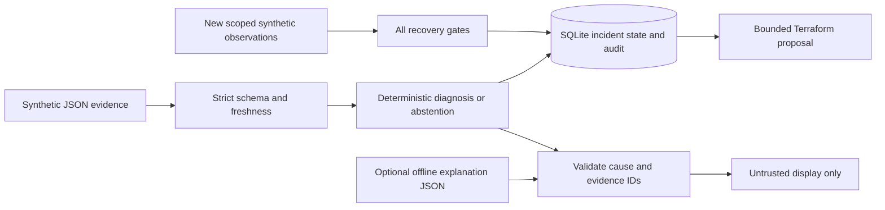
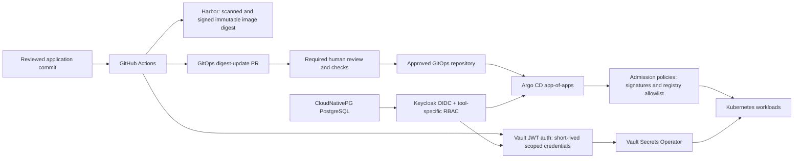

# Architecture and integration stages

## Current executable system



State transitions:

```text
investigated -> proposal_ready -> awaiting_recovery -> recovered
                         \--------------------------> recovered
```

There is intentionally no `approved`, `applied`, or `quota_granted` state in this
release: no integration can attest to those events. Recovery is based on supplied
observations, not on a fabricated deployment result. A recovered incident is
terminal; a recurrence requires a new incident key.

Investigation replay is idempotent for identical evidence. Changed evidence under
the same scoped key is rejected. Identical proposal replay is idempotent; a different
target is rejected. Verification appends each accepted observation; it rejects
time regression. SQLite transactions serialize state changes. This is local
durability, not a distributed queue or a tamper-proof audit service.

The single timestamp assumes an already-correlated snapshot. Future collectors
must preserve per-source timestamps, event IDs, account/region/cluster attribution,
quota bucket/instance-family coverage, and correlation windows. The current schema
does not authenticate evidence provenance and must not accept arbitrary production
input as authoritative.

## Planned secure delivery plane



This is a design, not a runnable deployment. OIDC integrations, Harbor authentication,
Vault policies, and admission signature verification each require separate validation.
Human SSO and workload identity are distinct.

### Stage 1: reproducible bootstrap

Choose a cluster target and storage topology first. cert-manager needs a selected
issuer/challenge mechanism; certificate availability cannot simply be assumed.
Provision foundational operators/storage, database readiness, Keycloak realm and
clients, then dependent tools with OIDC enabled. App-of-apps and sync waves order
resources; explicit health checks and retry/timeout policies gate readiness.
Retain an audited, restricted break-glass bootstrap/recovery path.

Longhorn is optional, not automatically the right choice for EKS. Evaluate managed
storage, failure domains, backup destinations and restore procedures before choosing.
Test loss of database, storage, certificates, identity, and Vault independently.

### Stage 2: secure delivery

Authenticate GitHub Actions to Vault using JWT/OIDC claims bound to the expected
repository, branch/environment and audience. Use short-lived Harbor robot credentials
with project-limited permissions. Build, scan, produce SBOM/provenance, sign the image,
and create a PR updating an immutable digest. Admission policy verifies signatures
and approved image sources before deployment. Protect workflow files and GitOps paths.
Do not expose secrets to untrusted pull-request builds.

### Stage 3: read-only SRE integration

Separate Kubernetes read RBAC, AWS diagnostic IAM, GitHub App proposal permissions,
and deployment identities. Capture real CloudTrail failures, NodeClaims, Pending pod
events and correct Service Quotas/usage bucket. Reject stale, contradictory or
unauthenticated evidence. Redact locally before any opt-in model call.

AI may explain evidence and rank hypotheses, but cannot authorize remediation or
invent observed facts. Tools require schemas, allowlists, timeouts, bounded results,
rate limits and audit trails. Model outages must not disable alerts or manual diagnosis.

### Stage 4: reviewed execution and verified recovery

An allowlisted GitHub App creates a bounded Terraform PR in an explicitly mapped
repository/path. Human review and a protected deployment environment gate execution.
Inspect the complete plan for unrelated changes. Argo CD reconciles Kubernetes;
Terraform's separately scoped workflow submits AWS quota requests.

Persist submission IDs and poll effective quota with bounded backoff, deadlines and
escalation. Approval can be delayed or denied. Verify launches, scheduling and
application SLO recovery over a stability window. Even an approved quota does not
guarantee instance availability.

## Future evaluation

Measure root-cause accuracy, false-positive proposal rate, abstention behavior,
time-to-diagnosis, evidence freshness, policy violations and recovery false positives.
Add negative fixtures for IAM, insufficient capacity, affinity/taints, certificate
and registry errors. Record model/version and token costs only when a real model
adapter is added. Do not advertise synthetic demo timings as production MTTR gains.
